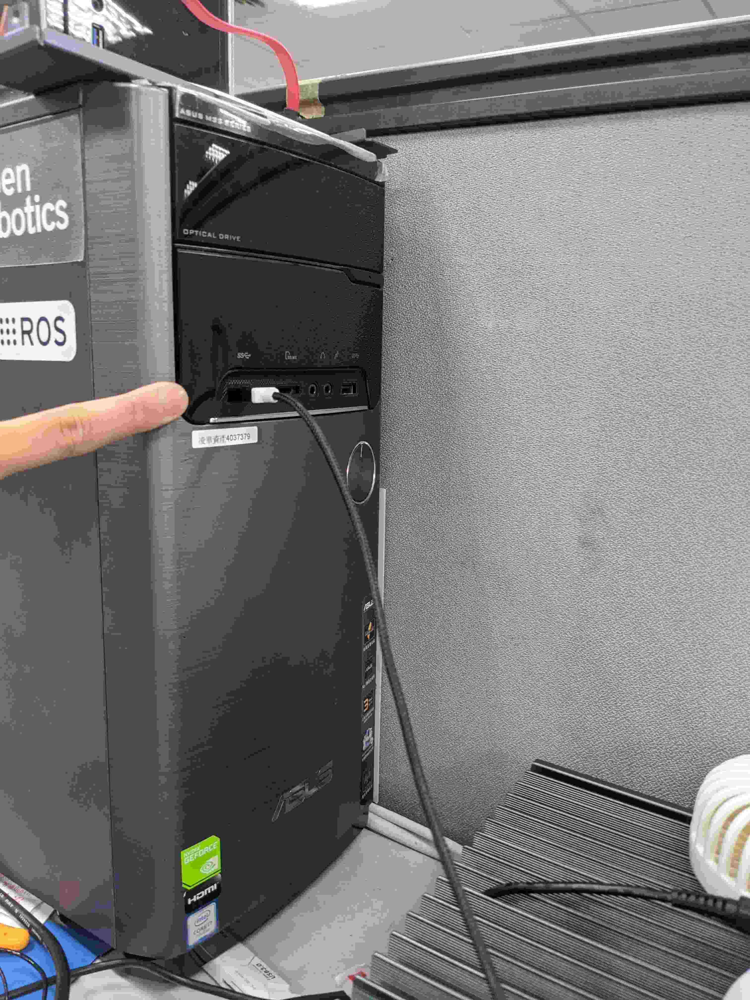

.. _board_level_flash:

Board Level ROScube Pico Flashing Image
^^^^^^^^^^^^^^^^^^^^^^^^^^^^^^^^^^^^^^^

1. Set ROScube Pico into recovery mode
--------------------------------------

1. Connect power cable to ROScube Pico.

.. image:: images/connect_power_cable.jpg
  :width: 60%
  :align: center

2. Power on ROScube Pico. (Press power button)

.. image:: images/power_on.jpg
  :width: 60%
  :align: center

3. Short **Pin 09 and Pin 10** and **hold short status**.

.. image:: images/short_recovery.jpg
  :width: 60%
  :align: center

.. image:: images/PM_header.png
  :width: 60%
  :align: center

4. **Hold Pin 09 and Pin 10 short status** and press **Reset** button.

.. image:: images/reset_cube.jpg
  :width: 60%
  :align: center

5. Release **Short pins** and **pull out short pins!!**.

.. note::
    
    **Now ROScube Pico is in recovery mode.**

2. Connect Host PC and ROScube Pico with micro usb cable.
---------------------------------------------------------

.. image:: images/cube_micro_usb.jpg
  :width: 60%
  :align: center

3. Prepare released image on **Host PC** 
------------------------------------------

Assuming image's file name is ``mfi_npn2_3.1.2.tbz2``. Un-archive this file first.

.. code-block:: bash

    tar xvf mfi_npn2_nvidia-sample-rootfs_L4T-32-4-3-Kernel-1-0-6.tbz2

Then, use BSP internal tool, ``nvmflash.sh`` to run the flashing procedure. **Please make sure your Host PC has attached to ROScube Pico**.

.. code-block:: bash

    cd mfi_npn2
    sudo ./nvmflash.sh 

.. note::

    You may need to input your **host PC**'s root password when flashing the image.

.. note:: 

    The flashing procedure might take 8 ~ 10 minutes.